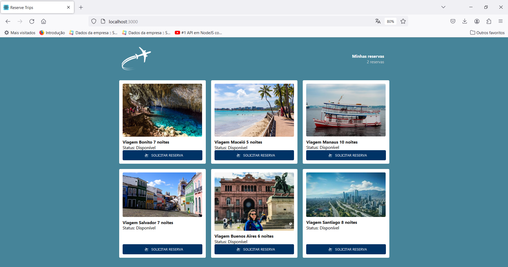
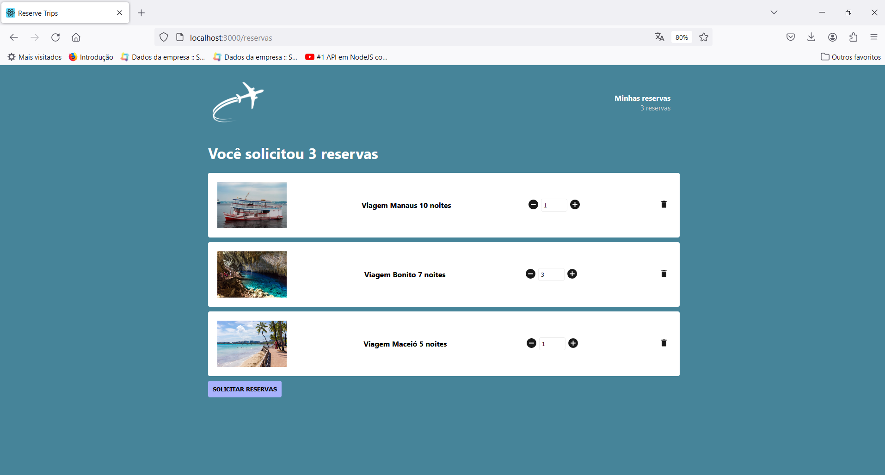

# reserve-trips
Projeto contruído em ReactJS onde são feitas reservas de viagem através de um carrinho de compras fictício utilizando as tecnologias Redux com Redux Saga.

### Bibliotecas utilizadas

• react-router-dom <br />
• axios <br />
• history <br />
• immer <br />
• redux <br />
• react-redux <br />
• redux-saga <br />
• react-icons <br />
• json-server <br />

### Motivações para utilização
A aplicação engloba uma página na qual se realiza reserva de viagens de acordo com os lugares e quantidade de reservas permitidas. Não é possível registrar menos do que 1 reserva e também não é possível solicitar um número de reservas maior do que o cadastro retornado da Api.

Como o foco está no carrinho de compras, foi utilizado um backend "fake" que retorna as informações previamente cadastradas no arquivo server.json. Para mais opções de reserva, basta aumentar a quantidade de objetos desse arquivo (mantendo o mesmo padrão de estrutura e propriedades, obviamente).

### Para executar a aplicação

### backend
• Abra uma janela do prompt separada;

• Execute o comando abaixo para rodar o backend com alguns produtos previamente cadastrados:

```
json-server server.json -p 3333
```

### frontend
• Abra uma janela do prompt separada;

• Execute o comando abaixo para rodar o frontend que irá se comunicar com o backend rodando em paralelo:

```
yarn start
```

### screenshots



### Para executar os testes da aplicação
• Abra uma janela do prompt separada;

• Execute o comando abaixo para rodar os testes unitários configurados na aplicação:

```
yarn test
```
